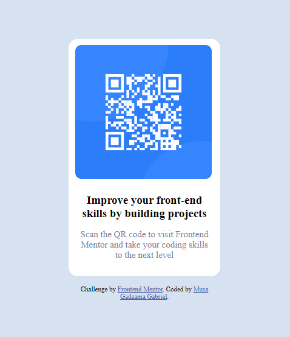

# Frontend Mentor - QR code component solution

This is a solution to the [QR code component challenge on Frontend Mentor](https://www.frontendmentor.io/challenges/qr-code-component-iux_sIO_H). Frontend Mentor challenges help you improve your coding skills by building realistic projects. 

## Table of contents

- [Overview](#overview)
  - [Screenshot](#screenshot)
  - [Links](#links)
- [My process](#my-process)
  - [Built with](#built-with)
  - [What I learned](#what-i-learned)
  - [Useful resources](#useful-resources)
- [Author](#author)


## Overview

### Screenshot



### Links

- Live Site URL: [Add live site URL here]([https://your-live-site-url.com](https://kingmusa124.github.io/qr-code-component/))

## My process

### Built with

- Semantic HTML5 markup
- CSS custom properties
- CSS Flexbox


### What I learned

I learnt hot to center content and alignment of text 


```html
<h1>Some HTML code I'm proud of</h1>
```
```css
.proud-of-this-css {
  color: papayawhip;
}
```

### Useful resources

- [Mdn Doc](https://developer.mozilla.org/en-US/docs/Web/CSS) - This helped me for most of the CSS i wrote it was really helpful. It's a site i can see my self visiting quite often moving foward.I'd recommend it to anyone still learning CSS.

## Author


- Frontend Mentor - [@kingmusa124](https://www.frontendmentor.io/profile/kingmusa124)
